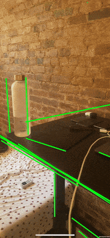

# Line Cam
Realtime line detection on iOS and Android in Unity Engine with NatML.

## Requirements
- Unity 2019.2+
- [NatML 1.0+](https://github.com/natsuite/NatML)
- [@natsuite/line-segment-detector](https://hub.natsuite.io/predictor/@natsuite/line-segment-detector)
- [NatDevice 1.1+](https://assetstore.unity.com/packages/tools/integration/natdevice-media-device-api-162053)

## Supported Platforms
- Android API level 24+ (Android Nougat or newer)
- iOS 13+
- macOS 10.15+
- Windows 10 (64-bit)

## Quick Tips
- [Get NatML](https://github.com/natsuite/NatML).
- Join the [NatSuite community on Discord](https://discord.gg/y5vwgXkz2f).
- Read the [NatSuite blog](https://blog.natsuite.io/).
- Contact us at [hi@natsuite.io](mailto:hi@natsuite.io).

Thank you very much!